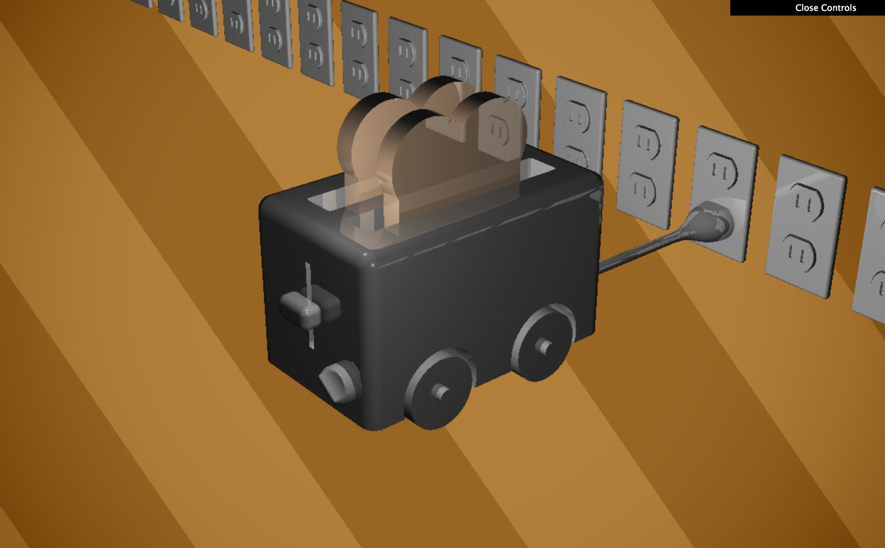

# CIS-566-Project-2
https://github.com/CIS-566-2018/homework-2-ray-marching-implicit-surfaces

## Caroline Lachanski's Results:

Demo: https://clach.github.io/homework-2-implicit-surfaces-clach/

A real-time raymarched scene entirely written in the fragment shader! Featuring [signed distance functions] (https://www.iquilezles.org/www/articles/distfunctions/distfunctions.htm), domain repetition, and specular reflection.

